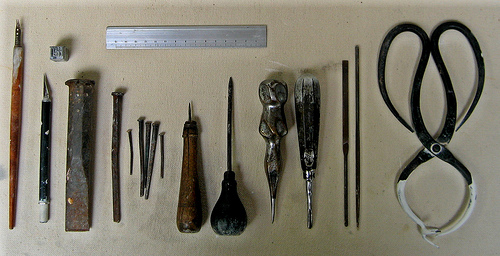
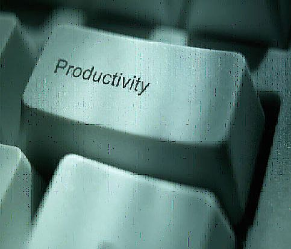

!SLIDE

# In search for better tools

### by Nugroho Herucahyono, edLabora

!SLIDE center

## For a better craftsmanship

> http://www.flickr.com/photos/dianafayt/2424747926/

!SLIDE center

#Why?

!SLIDE center

> ### Every craftsman starts his or her journey with a basic set of good-quality tools. --pragprog
> http://www.flickr.com/photos/dallaportfolio/2982621550/

!SLIDE bullets incremental
# These tools should be
* lovingly choosen
* built to last
* perform specific jobs with little overlap with other tools
* feel "right" in his hands

!SLIDE

> ##The better your tools, and the better you know how to use them, the more productive you can be.

!SLIDE bullets incremental
# so?

* start with a basic set of generally applicable tools
* expect to add to your toolbox regularly
* always be on the lookout for better ways of doing things
* let need drive your acquisitions.

!SLIDE bullets incremental

# Conclusion?

* tools do matter
* always search for a better tool / way
